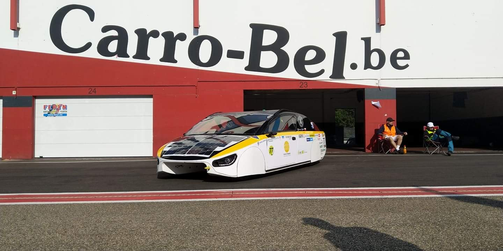

# PUT Solar Dynamics
PUT(Poznan University of Technology) Solar Dynamics is student organization that is promoting using solar energy as a green energy source in electric vehicle.

## Hi there 👋

🙋‍♀️ Introduction - Our organization is constructing electric vehicles which are using solar panels to collect and recharge partially our EV while driving. We are constructing our own aerodynamics, suspension and electric system. 

🌈 Activities - We are taking part in various events such as solar vehicles competitions, but also we are part of huge students community on Poznan University of Technology and support honourable ideas such as blood donations organized by us and NZS organization on university. We provide our students with many opportunities to learn and support them in their studies by providing equipment and tools, as well as knowledge of more experienced members of organization.

:construction_worker: Example of previous projects:
- ECM (Electronic control module) - is device that controls numerous electronic devices inside of car and allows us to monitor what is exactly going on with electronics as well as detect problems (Szymon Kacperek, Szymon Kwiatkowski)
- Aerodynamics and body of car - constructed to have as little air resistance as possible (Adam Kłos), then fully made by us using laminate(Credits to Model Art for providing us opportunity to learn)
- Roll cage - durable, made with iron bars to provide driver with safety(Jakub Wytykowski)
  
And many more

# Our first project - **Klara**
Klara was made within 5 years timespan and now is object of our reasearch and tests. We also participated with this car in European Solar challange in 2021. 

<!--

**Here are some ideas to get you started:**

🙋‍♀️ A short introduction - what is your organization all about?
🌈 Contribution guidelines - how can the community get involved?
👩‍💻 Useful resources - where can the community find your docs? Is there anything else the community should know?
🍿 Fun facts - what does your team eat for breakfast?
🧙 Remember, you can do mighty things with the power of [Markdown](https://docs.github.com/github/writing-on-github/getting-started-with-writing-and-formatting-on-github/basic-writing-and-formatting-syntax)
-->
